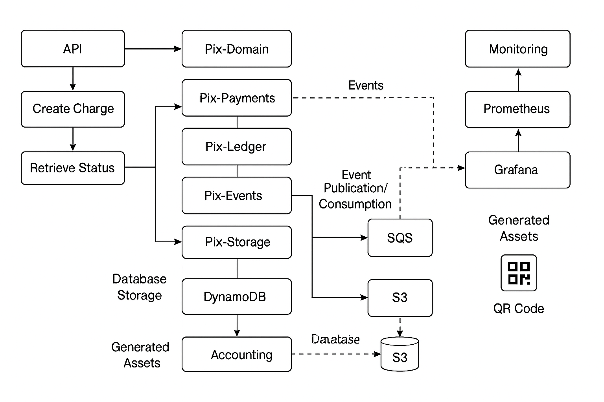

# Pix Simulator

Simulador de transações Pix com arquitetura modular, mensageria, observabilidade e integração com serviços AWS simulados via LocalStack.

## 📦 Módulos

- **pix-api** → API REST principal
- **pix-domain** → Entidades e regras de negócio
- **pix-events** → Integração com mensageria (SQS/SNS)
- **pix-storage** → Persistência de dados
- **pix-ledger** → Registro de transações
- **pix-monitoring** → Métricas e observabilidade

## 🚀 Stack

- **Java 21 + Spring Boot 3.3.4**
- **PostgreSQL 16**
- **LocalStack** (SQS, SNS, S3, DynamoDB)
- **NGINX** (reverse proxy e rate limiting)
- **Prometheus + Grafana** (monitoramento)
- **Portainer** (UI para gerenciar containers)





## 📋 Pré-requisitos

- Docker e Docker Compose instalados
- Conta no Docker Hub (opcional, para publicar imagens)

## ▶️ Como rodar

1. Clone o repositório:
   ```bash
   git clone https://github.com/seu-usuario/pix-simulator.git
   cd pix-simulator
